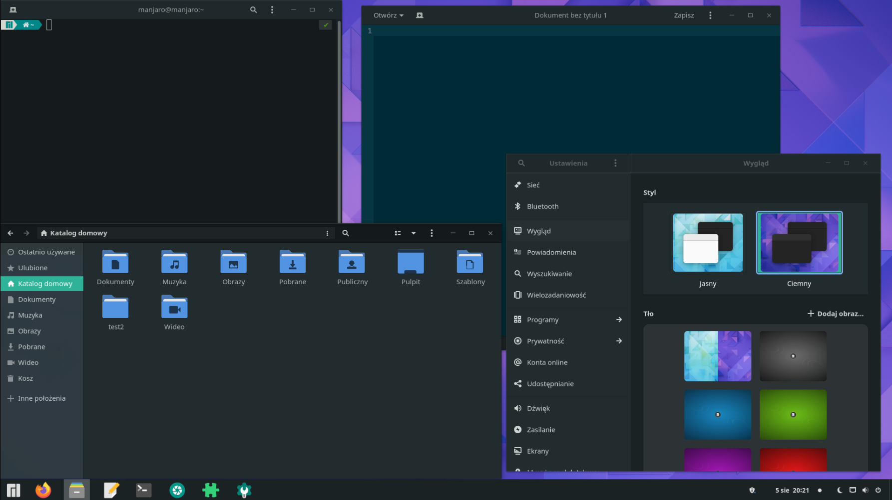
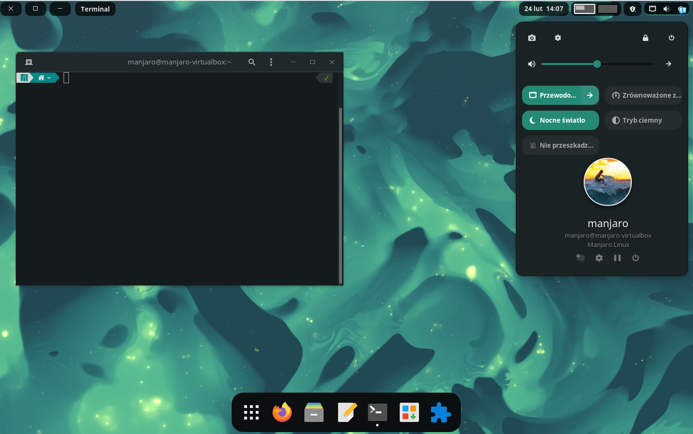

# manjaro-dark-sea

Gnome Shell theme. Supports Gnome 41 and 42

# installation

- Install or enable extension User Themes https://extensions.gnome.org/extension/19/user-themes/
- Install or enable extension Unite https://extensions.gnome.org/extension/1287/unite/
- Download and install theme

```
cd ~/.themes
git clone https://github.com/pawelswiszcz/manjaro-dark-sea.git
ln -s ~/.themes/manjaro-dark-sea/gtk-4.0/assets ~/.config/gtk-4.0/assets
ln -s ~/.themes/manjaro-dark-sea/gtk-4.0/gtk-dark.css ~/.config/gtk-4.0/gtk.css
ln -s ~/.themes/manjaro-dark-sea/unite/manjaro-dark-sea ~/.local/share/gnome-shell/extensions/unite@hardpixel.eu/themes/manjaro-dark-sea
```






Based on Matcha-dark-sea theme and Deepin buttons